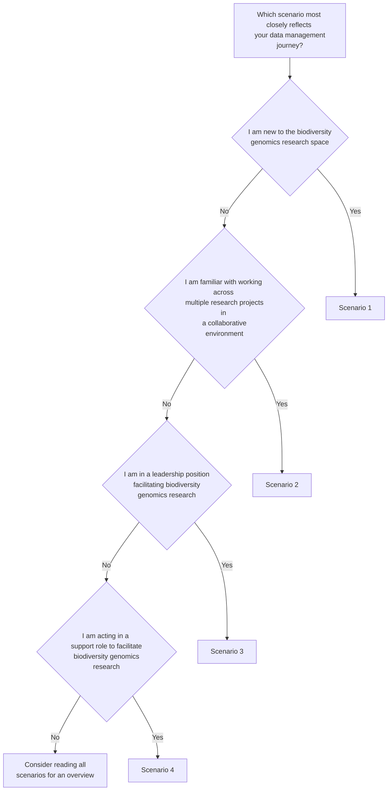

# Introduction

Welcome to the genomic data management repository. This repository is intended as a resource that sits alongside the manuscript *Journeying towards best practice: tips and tricks for improved data management for biodiversity genomics researchers* [link]. Content can be used freely to support biodiversity genomic data management. If the manuscript or repository are referred to in research, these should be cited as [MS citation], [GitHub repo citation]. 

The primary goal of this repository is to support biodiversity genomics researchers in developing good data management practices, in line with the FAIR and CARE data stewardship principles (https://www.go-fair.org/fair-principles/, https://www.gida-global.org/care). For more on the ethics and benefits of data management, see Module X. We aim to empower the biodiversity genomics community to minimise risks and maximise research impact now and into the future. We encourage researchers to view data management as a behaviour intrinsic to the research process, and to adopt a mindset of adaptability to the various hurdles you may encounter along the way.

In this repository we outline four scenarios[1,2,3,4] that illustrate some of the challenges associated with genomic data management. We use these examples to demonstrate a diversity of realistic considerations, compromises, and actions for biodiversity genomic data management. While we acknowledge that real life is not typically this tidy, we hope that you may see your own experiences reflected through some combination of these scenarios. While you are likely to relate most strongly with one scenario, we encourage you to peruse all four scenarios to gain a breadth of perspectives across career stages and roles.

Within the scenarios, we point to modules that examine these challenges and provide resources and solutions to help you on your data management journey. While these modules are non-exhaustive, they will be regularly updated as new solutions come to light. 

% Nat test inserting flowchart here

