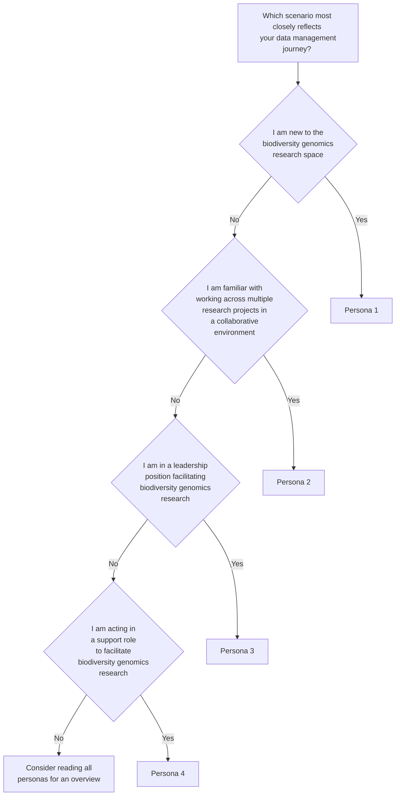

# Introduction

Welcome to the Biodiversity Genomic Data Management Hub! We recognise that biodiversity genomic data management can be a challenge, particularly for researchers entering this space, and you are likely to have many questions as you proceed on your journey. The primary goal of this repository is to support biodiversity genomics researchers in developing good data management practices that embody the [FAIR](https://www.go-fair.org/fair-principles/) and [CARE](https://www.gida-global.org/care) data stewardship principles, as described in <a href="#citation-licensing">Citation & Licensing.</a>

!!! info "Good practice versus best practice" 

    Here we recognise there are different standards of data management. We acknowledge that best practice is aspirational, and achieving best practice may not always be practicable within the constraints of a research project due to external factors (see [Personas](https://genomicsaotearoa.github.io/data-management-resources/personas/)). Instead, we prefer to encourage researchers to pursue ‘good practice’ data management as a stepping stone on the journey towards best practice. 

In this hub we draw on our personal experiences to describe [four personas](https://genomicsaotearoa.github.io/data-management-resources/personas/) across the research ecosystem that illustrate some of the challenges associated with genomic data management. We use these personas as examples to demonstrate a diversity of realistic considerations, compromises, and actions for biodiversity genomic data management. While we acknowledge that real life is not typically this tidy, we hope that you may see your own experiences reflected through some combination of these personas. While you are likely to relate most strongly with one persona, we encourage you to peruse all four personas to gain a breadth of perspectives across career stages and roles.

!!! question "Who are we?"
    
    We are a cross-institutional, interdisciplinary, and multi-career stage collaborative team based in Aotearoa New Zealand. This team includes biodiversity genomic researchers, local and national IT, eResearch and computational infrastructure support staff, and those with broad interests in the inclusion of Indigenous perspectives pertaining to biodiversity genomic data. Together, we have extensive experience in overseeing conservation genomic research projects, curating and managing conservation genomic data sets, developing project-specific data management plans (DMPs), and providing data management solutions to research groups.

Based on the questions that arise from these personas, we direct you to [modules](https://genomicsaotearoa.github.io/data-management-resources/modules/) that examine these challenges in more detail and provide resources and solutions to help you on your data management journey. While these modules are non-exhaustive, they will be regularly updated as new solutions come to light. 

Through this hub, we aim to empower the biodiversity genomics community to minimise risks and maximise research impact now and into the future. We encourage researchers to view data management as a behaviour intrinsic to the research process, and to adopt a mindset of adaptability to the various hurdles you may encounter along the way.

!!! note "Citation & Licensing"

    **Biodiversity Genomic Data Management Hub** material is licensed under the **Creative Commons Attribution 4.0 International Public License (CC-BY 4.0)**. ([See here for more information](https://github.com/GenomicsAotearoa/data-management-resources/blob/main/LICENSE)). 
    This repository is intended as a resource that sits alongside the manuscript *Journeying towards best practice: tips and tricks for improved data management for biodiversity genomics researchers* [link to add in due course]. If you refer to the manuscript or repository in research, we request that you include the citation:
    > Forsdick, N. J., Wold, J. R., Angelo, A., Bissey, F., Hart, J., Head, M., Liggins, L., Senanayake, D., & Steeves, T. E. (2023). Journeying towards best practice: tips and tricks for improved data management for biodiversity genomics researchers. *More details to add in due course.* 
    
    
<html lang="en">
    
        

        

            

                <h1>Developers</h1>
                <ul>
                    <li>Mosh</li>
                </ul>
            

            

                <h1>Creation</h1>
                <ul>
                    <li>Social-site</li>
                    <li>Software</li>
                </ul>
            

            

                <h1>About</h1>
                <ul>
                    <li>Terms</li>
                    <li>Get in touch</li>
                </ul>
            

            

                <h1>Support</h1>
                <ul>
                    <li>Contact us</li>
                </ul>
            

            

                <h1>Social</h1>
                <ul>
                    <li></li>
                    <li></li>
                    <li></li>

                </ul>
            

            

            <footer class="foot">
             Biodiversity Genomics Data Management Hub  is licensed under a <a rel="license" href="http://creativecommons.org/licenses/by/4.0/">Creative Commons Attribution 4.0 International License</a>.
            </footer>
        

    

