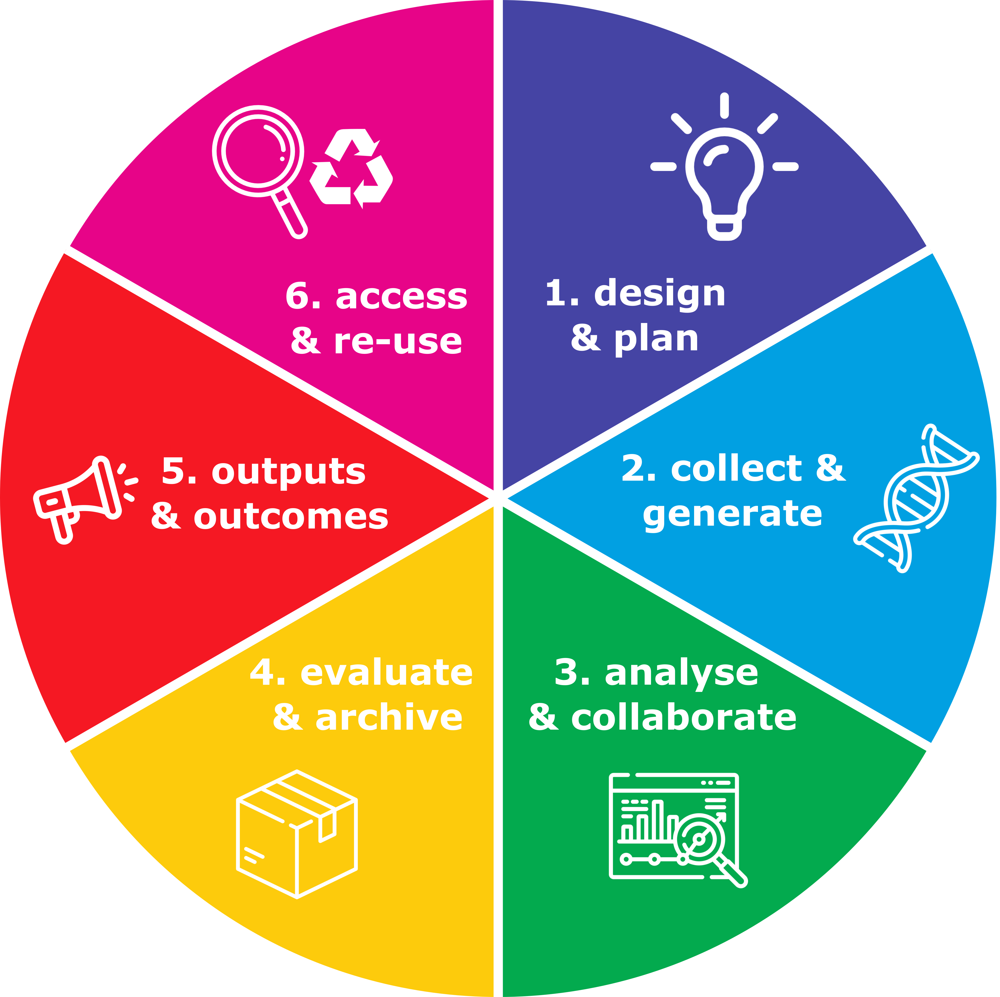

# Module overview

Here you can find a series of modules filled with tips and tricks to support you on your data management journey. Use what works, adapt as needed, and leave the rest. 

We present a simplified figure describing the data lifecycle within the broader research lifecycle, and indicate at which points the accompanying modules may be most relevant for implementing the associated data management actions. 

  All icons created by Freepik at <a href="https://www.flaticon.com/free-icons/">Flaticon</a>.

[Module 01](https://genomicsaotearoa.github.io/data-management-resources/modules/module01/) - Top tips and tricks to make data management easy

[Module 02](https://genomicsaotearoa.github.io/data-management-resources/modules/module02/) - The ethics and benefits of good data management practices

[Module 03](https://genomicsaotearoa.github.io/data-management-resources/modules/module03/) - Hot, warm, and cold data storage

[Module 04](https://genomicsaotearoa.github.io/data-management-resources/modules/module04/) - Helping eResearch support staff help you

[Module 05](https://genomicsaotearoa.github.io/data-management-resources/modules/module05/) - Designing, co-developing, and adapting data management plans

[Module 06](https://genomicsaotearoa.github.io/data-management-resources/modules/module06/) - Incorporating Indigenous data sovereignty considerations

[Module 07](https://genomicsaotearoa.github.io/data-management-resources/modules/module07/) - The what, why and how of metadata management

[Module 08](https://genomicsaotearoa.github.io/data-management-resources/modules/module08/) - Daily data management - workflow management, version control, and dependency management 

[Module 09](https://genomicsaotearoa.github.io/data-management-resources/modules/module09/) - Templates for data management

[Module 10](https://genomicsaotearoa.github.io/data-management-resources/modules/module10/) - Best practice data management resources
