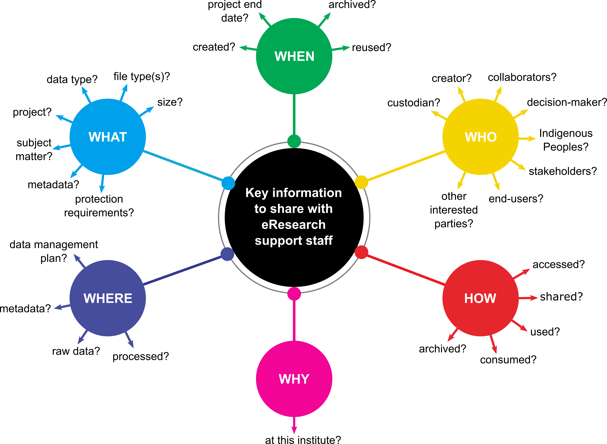

# Module 04 - Helping eResearch and libraries staff help you

Trying to navigate your institute's framework for data storage and management can be a lot like travelling through a new city when your phone battery has died. You may have a vague sense of the direction, but no idea of what you're looking for or how to get there. But never fear, eResearch and libraries staff are here to help!  

There is one caveat to this: to best support research groups with their data management needs, eResearch and libraries staff require context and clarification to enable them to design and deliver appropriate solutions. The more information they have, the better the solutions they can provide. It may be helpful to consider the following list of needs and questions from an eResearch support person, both during conversations with eResearch and libraries staff, but also when developing DMPs. Not all of these questions can be answered at the outset of a project, but it can be helpful to keep them in mind as you progress along the data life cycle.

## What eResearch and libraries staff want from researchers

While supporting researchers, eResearch teams have their own wants and needs that must be met to ensure they can deliver wrap-around data management solutions. Some of these include:

  
  
  :open_file_folder: <b> Information on the research project</b>
  <li>Who is responsible for the data? Who can make decisions about its management? This can be a person or a group, and preferably there is a clear chain of custody so the data is never orphaned inside the institution.</li>
  <li>How is the research funded? Research funders often require applicants to prepare and submit DMPs as part of their research funding application.</li>
  <li>Are there any allocated funds for research compute & storage?</li>
  <li>What are the project timelines and deliverables so that I can forecast these needs for the future?</li>

  :page_with_curl: <b> Information on the research data</b>
  
  <li>I do not want researchers to put all their data in monolithic heaps. I want them to provide unique identification for each data set they want stored. All downstream data management solutions depend on this.</li>
  <li>What kind of protections are required for the data? Is it personal data, Indigenous data, commercial data or open data?</li>
  <li>Who can access the data within these protections? Are there any external collaborators that will require access to the data?</li>
  <li>How will the data be consumed? How do the researchers want to access the data within the protections that need to be met?</li>
  <li>What is the expected data volume? How will it grow over time?</li>
  <li>What should be done with the data once it has reached the end of the immediate research life cycle?</li>
  <li>Are there plans for the preservation and archiving of the datasets, and if so, which files, and for how long?</li>
  <li>Can or should data be deleted in the future?</li>
  <li>What outputs will your research will generate, and will this data have value to other researchers?</li>

  

  :question: <b> Information on support needs</b>
  
  <li>What resources will you require to carry out your research? Will you need specific hardware, software, additional training or access to technical expertise?</li>

*[DMP]: Data Management Plan
*[eResearch]: The use of digital tools and techniques to advance research
*[eResearch and libraries staff]: A broad group including research software engineers, research infrastructure developers, data scientists, data stewards, and other professional services staff that deliver library, IT, bioinformatics, and high-performance computational support
