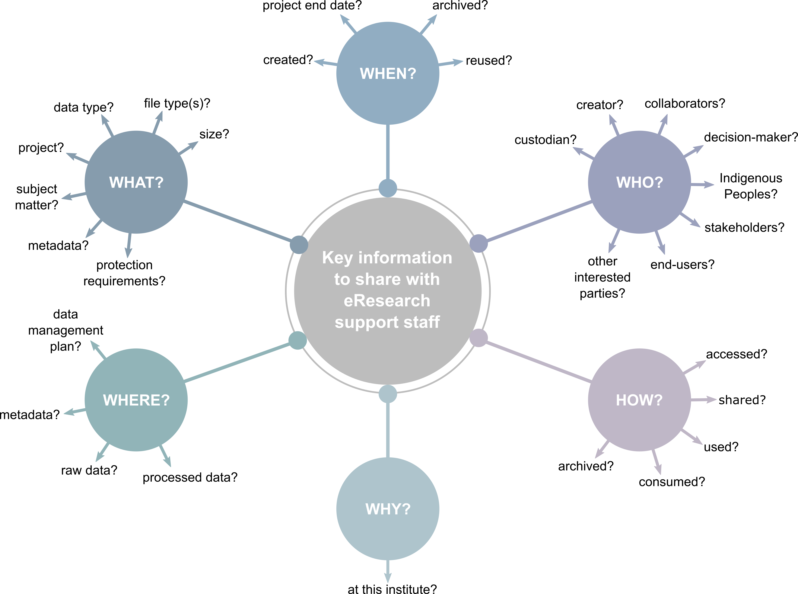

# Module 07 - Helping eResearch support staff help you

To best support research groups with their data management needs, eResearch support staff require context and clarification to deliver appropriate solutions. The more information they have, the better the wrap-around solutions that can be delivered. It may be helpful to consider the following list of needs and questions from an eResearch support person, both during conversations with eResearch support staff, but also when developing DMPs. Not all of these questions can be answered at the outset of a project, but it can be helpful to keep them in mind for the future.

## What eResearch support teams want from researchers

While supporting researchers, eResearch teams have their own wants and needs that must be met to ensure they can deliver wrap-around data management solutions. Some of these include:

  <li>I do not want researchers to put all their data in monolithic heaps. I want them to provide unique identification for each data set they want stored. All downstream data management solutions depend on this.</li>
  <li>I want to know who is responsible for the data. Who can make decisions about its management?  This can be a person or a group, and preferably there is a clear chain of custody so the data is never orphaned inside the institution.</li>
  <li>I want to know what kind of protection the data needs. Is it personal data, sovereign data, commercial data or open data?</li>
  <li>I want to know who can access the data within these protections.</li>
  <li>I want to know how the data is to be consumed. How do the researchers want to access the data within the protections that needs to be met?</li>
  <li>I want to know much data we should expect in the data set? How will it grow over time?</li>
  <li>I want to know what should be done with the data once it has reached the end of the immediate research lifecycle?</li>
  <li>I want to know whether data can or should be deleted in the future?</li>
  

