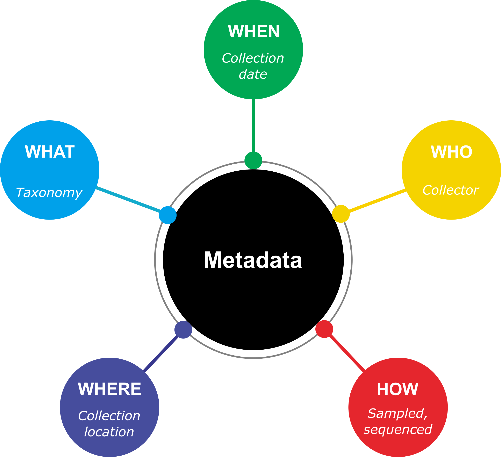

# Module 07 - The what, why, and how of metadata management

## What is metadata?

Metadata in its broadest form is 'the data about the data'. Metadata provides the spatio-temporal context for digital sequence information, and may be vital for interpreting and contextualising results. For biodiversity genomics data (a.k.a. digital sequence information; DSI), the core metadata is defined by community standards such as the [Genomics Standards Consortium](https://www.gensc.org/index.html) and [Biodiversity Information Standards](https://www.tdwg.org/), including the MIgS and [MIxS](https://genomicsstandardsconsortium.github.io/mixs/) specifications. 

<!---->

<figure>
  

  <figcaption>
    An overview of the minimum metadata for genomic data.
  </figcaption>
</figure>

For processed data, metadata will also include information such as what software, software versions, and parameters were used. Additional metadata may include associated keywords, downstream publications, funding sources, and data access and licensing details. To get an idea of metadata beyond the minimum, check out the [Darwin Core terms](https://dwc.tdwg.org/list/) for an extensive list. 

## Why should we be collecting and managing metadata?

Metadata should be recorded and managed alongside DSI to ensure that results produced using these data can be placed into the appropriate context. Collation and stewardship of metadata is also essential to ensure that data meet the requirements of the FAIR Principles, and so facilitating the traceability and future use of data. Not only that, but metadata describing the spatiotemporal context for data enables the connection of DSI to Indigenous communities, facilitating benefit-sharing into the future.

## How can we best manage metadata?

At its core, metadata collation and stewardship all come down to the need for thorough and consistent record-taking and record-keeping throughout the lifespan of a project - from sample collection through to dissemination of results. Starting early will save you from headaches down the track! 

Portals such as the Genomic Observatories MetaDatabase (GEOME) and the Collaborative Open Plant Omics (COPO) allow users to generate template to populate with metadata associated with DSI. By using existing templates, users can ensure that metadata is recorded in ways that are consistent with biodiversity genomics community standards.

Tools such as version control, software containers, and workflow management systems can be extremely helpful in tracking metadata during data processing and analysis. These tools can be particularly useful when shared across the research group, along with guidelines for directory structure and file naming conventions, ensuring time-wide consistency.

*[MIgS]: Minimum Information about a Genome Sequence
*[MIxS]: Minimum Information about any (X) Sequence
*[DSI]: Digital Sequence Information
