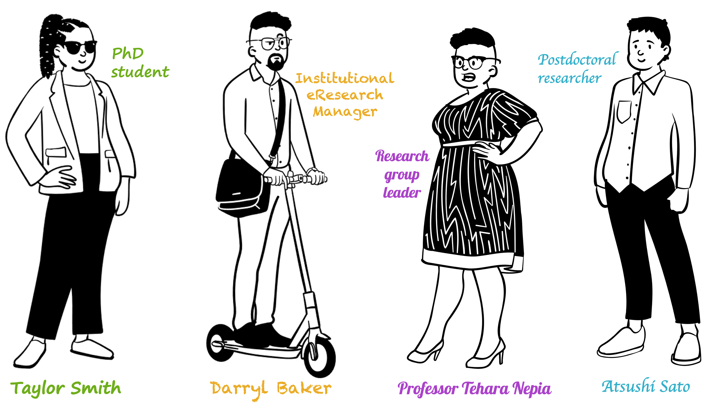

# Personas overview

Here we describe four user-experience personas across a diversity of career stages and roles within the research ecosystem. We use these to highlight some of the key questions and concerns associated with genomic data management, based on our personal data management journeys. We hope that you are able to relate to some of the challenges experienced by these personas in their data management journeys. To gain a broad understanding across various perspectives, we recommend investigating all four personas.

[Persona 1](https://genomicsaotearoa.github.io/data-management-resources/personas/persona1/) - A student new to biodiversity genomics 

[Persona 2](https://genomicsaotearoa.github.io/data-management-resources/personas/persona2/) - An early career researcher working collaboratively

[Persona 3](https://genomicsaotearoa.github.io/data-management-resources/personas/persona3/) - A biodiversity genomics research team leader

[Persona 4](https://genomicsaotearoa.github.io/data-management-resources/personas/persona4/) - An eResearch staff member

