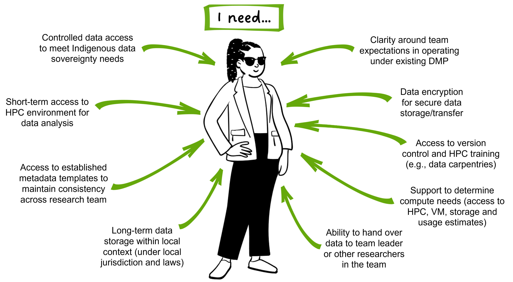

# Persona 1 

## PhD student Taylor Smith

New PhD student Taylor Smith has started a research project that will use genomic data to inform conservation management for a culturally significant species. Their project involves data collection and generation, analysis using the local compute infrastructure provided by their institute, and dissemination of results to end-users including conservation practitioners and local communities. They will be operating under a data management plan (DMP) adapted from the template used across their research group, and they have access to internal training and external support structures. 

Their research group is in the process of developing a lab manual that includes daily data management processes, along with onboarding and exiting procedures. Taylor is grateful for the supportive research group environment, as they feel comfortable asking questions and sharing thoughts to help develop these processes. While their data is yet to be generated, being involved in these processes ensures they have a clear understanding of what will be involved in managing their data. 

Taylor’s main concerns are around ensuring Indigenous data sovereignty and governance meet the needs of the Indigenous communities with cultural ties to the focal species (a newly described species of lizard/mokomoko) during the active life-span of the project. As the project has a defined end-date, they also want to ensure that there is a framework in place to uphold these requirements into the future. Communication around data management is primarily with their research group leader, Professor Nepia, who is maintaining long-term trust-based relationships with local communities, with additional support from their wider lab group. 

## Taylor’s key questions in their data management journey

* Why is data management important? -> See [Module 02](https://genomicsaotearoa.github.io/data-management-resources/modules/module02/) -  The ethics and benefits of good data management practices.
* What is metadata, and how should I manage it? -> See [Module 07](https://genomicsaotearoa.github.io/data-management-resources/modules/module07/) - The what, why and how of metadata.
* How can I structure directories for raw data and analysis? -> See [Module 08](https://genomicsaotearoa.github.io/data-management-resources/modules/module09/) - Incorporating data management into daily practice.
* How can I incorporate Indigenous data sovereignty perspectives in my data management practices? -> See [Module 06](https://genomicsaotearoa.github.io/data-management-resources/modules/module06/) - Incorporating Indigenous data sovereignty considerations.
* How can I incorporate data management in my daily workflows? -> See [Module 01](https://genomicsaotearoa.github.io/data-management-resources/modules/module01/) - Top tips and tricks to make data management easy, [Module 09](https://genomicsaotearoa.github.io/data-management-resources/modules/module09/) - Incorporating data management into daily practice.
