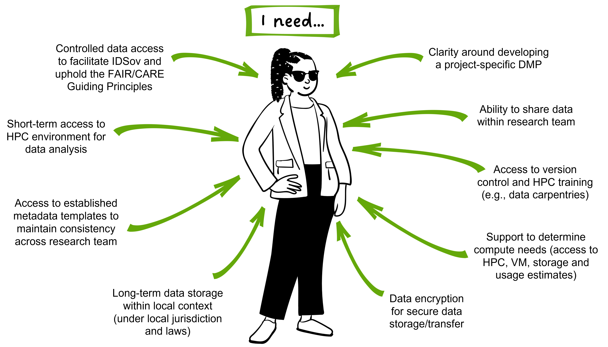

# Persona 1 

## PhD student Taylor Smith

New PhD student Taylor Smith has started a research project that will use genomic data to inform conservation management for a culturally significant species. Their project involves data collection and generation, analysis using the local compute infrastructure provided by their institute, and dissemination of results to end-users including conservation practitioners and local communities. They will be operating under a DMP adapted from the template used across their research group, and they have access to internal training and external support structures. 

Their research group is in the process of developing a lab manual that includes daily data management processes, along with onboarding and exiting procedures. Taylor is grateful for the supportive research group environment, as they feel comfortable asking questions and sharing thoughts to help develop these processes. While their data is yet to be generated, being involved in these processes ensures they have a clear understanding of what will be involved in managing their data. 

Taylor’s main concerns are in ensuring their data management practices facilitate Indigenous data sovereignty and upholds the FAIR and CARE Guiding Principles during the active life-span of the project. As the project has a defined end-date, they also want to ensure that there is a framework in place to uphold these requirements into the future. Communication around data management is primarily with their research group leader, [Professor Nepia](https://genomicsaotearoa.github.io/data-management-resources/personas/persona3/), who is maintaining long-term trust-based relationships with research partners, with additional support from their wider lab group. 

Mouse-over for definitions: DMP, HPC, IDSov, VM. See the [Glossary](https://genomicsaotearoa.github.io/data-management-resources/glossary/) for more details. 

## Taylor’s key questions in their data management journey

| Question | Associated module providing solutions | 
|:--|:--|
| Why is data management important? | The ethics and benefits of good data management practices [Module 02](https://genomicsaotearoa.github.io/data-management-resources/modules/module02/){ .md-button .md-button--primary }  |
| What is metadata, and how should I manage it? | The what, why and how of metadata [Module 07](https://genomicsaotearoa.github.io/data-management-resources/modules/module07/){ .md-button .md-button--primary } |
| What are some key things I should know as I begin my data management journey? | Top tips and tricks to make data management easy [Module 01](https://genomicsaotearoa.github.io/data-management-resources/modules/module01/){ .md-button .md-button--primary } |
| How can I structure directories for raw data and analysis? | Incorporating data management into daily practice [Module 08](https://genomicsaotearoa.github.io/data-management-resources/modules/module08/){ .md-button .md-button--primary } |
| How can I facilitate Indigenous data sovereignty in my data management practices? | Incorporating Indigenous data sovereignty considerations [Module 06](https://genomicsaotearoa.github.io/data-management-resources/modules/module06/){ .md-button .md-button--primary } |

*[CARE]: CARE Principles for Indigenous Data Governance
*[DMP]: Data Management Plan
*[FAIR]: FAIR Guiding Principles
*[HPC]: High performance computing
*[IDSov]: Indigenous data sovereignty
*[VM]: Virtual machine