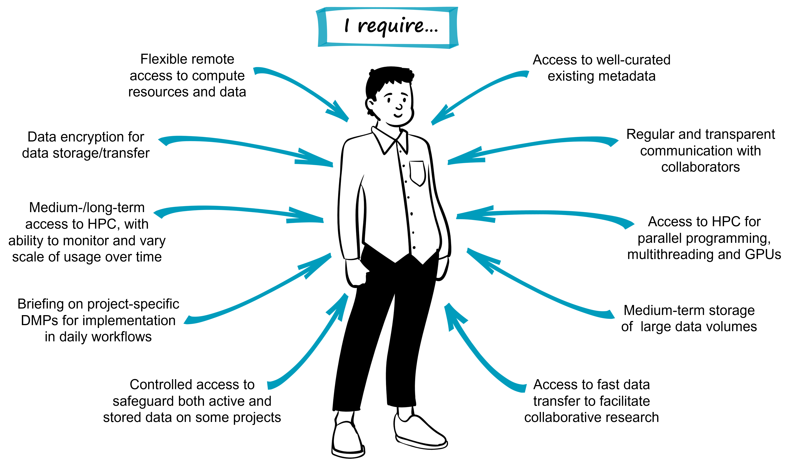

# Persona 2

## Research fellow Dr Atsushi Sato

Dr Atsushi Sato is a postdoctoral research fellow at a non-academic research institute, and contributes to several large international biodiversity genomics collaborations. These projects vary in scale, longevity, and data management requirements. Although he has some input in research planning and dissemination of results, his primary focus is the analysis of large data sets, and specifically in incorporating environmental and climate data alongside genomic data. To do this, he relies on comprehensive and consistent metadata that sits alongside each data set. Each project Dr Sato is involved with has its own established data management plan (DMP), so he must take care to ensure that the workflows he uses for each project align with the respective DMPs. 

He is experienced in biodiversity genomics, and is able to clearly describe his data management needs to the eResearch support team at his research institute. These needs predominantly relate to short-/mid-term storage and access, as the long-term storage of most of the datasets Dr Sato works with is the responsibility of researchers at other institutes. Dr Sato also seeks support from the eResearch team that deliver the national high-performance computing (HPC) infrastructure, where he can harness multithreading and parallel-processing for analysing large datasets. 

While Dr Sato’s skills are in high demand, he has been persistently employed on precarious short-term contracts. He finds this stressful, and is constantly looking for new opportunities that may lead towards his goal of attaining a permanent research position. These concerns impact his research priorities, as he perceives trade-offs between time spent on data management versus that spent on data analysis that can contribute towards his publication record. From Dr Sato’s perspective, data management is an onerous task.

Mouse-over for definitions: DMP, HPC, GPU. See the [Glossary](https://genomicsaotearoa.github.io/data-management-resources/glossary/) for more details. 

## Dr Sato’s key questions in his data management journey

| Question | Associated module providing solutions | 
|:--|:--|
| How can I embed data management processes in my daily workflows? | Incorporating data management into daily practice [Module 08](https://genomicsaotearoa.github.io/data-management-resources/modules/module08/){ .md-button .md-button--primary } |
| How do I ensure interoperability across large genomic and environmental data sets? | The what, why, and how of metadata management [Module 07](https://genomicsaotearoa.github.io/data-management-resources/modules/module07/){ .md-button .md-button--primary } |
| How can I get help with access to analysis and storage resources? | Helping eResearch and libraries staff help you [Module 04](https://genomicsaotearoa.github.io/data-management-resources/modules/module04/){ .md-button .md-button--primary } |

*[DMP]: Data Management Plan
*[HPC]: High performance computing
*[GPU]: Graphics processing unit