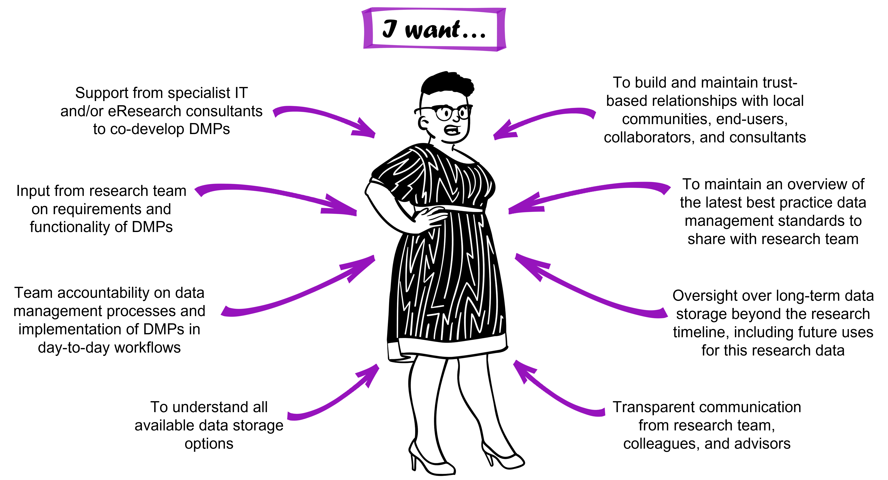

# Persona 3

## Research group leader Professor Tehara Nepia

Professor Tehara Nepia is a principal investigator at a university overseeing a conservation genomics research group including postgraduate students (including Taylor), postdoctoral researchers, and research associates. Her focus is on designing, facilitating, and disseminating research, and providing a supportive environment that generates highly-skilled emerging researchers well-equipped to contribute to the research, science, and innovation sector. Professor Nepia also places strong emphasis on building and maintaining trusted relationships with research partners, collaborators (including Dr Sato), and end-users. A substantial part of her role includes seeking and managing funding and resources (including compute and data storage) for the research group. 

The volume of data generated by Professor Nepia’s team is continually expanding, there is a growing need to ensure a smooth transition of data (including metadata) between members of her research group, and she is committed to embedding data management practices that are in line with FAIR and CARE principles. She is working towards a DMP template for use across all her research projects. To achieve this, Professor Nepia encourages open two-way communication with her research group to gain their perspectives of the needs and challenges associated with data management. She incorporates this information in project-specific DMPs. She relies upon her research group to adhere to the DMPs, and to support and encourage each other to do this, as she does not have capacity to micromanage (nor does she want to!). Beyond the DMPs, Professor Nepia and her team co-develop research group guidelines to streamline onboarding and exiting procedures, and the implementation of DMPs in day-to-day workflows, allowing new members to quickly get up to speed, and providing clear guidance on data management for those departing. 

To ensure workflows are aligned with best practice, she also engages with colleagues in similar situations nationally and internationally, including her disciplinary research community. In addition, Professor Nepia prioritises strong relationships with local IT and eResearch support staff (including Darryl) that are built on transparent, timely, bi-directional communication. Through knowledge-sharing, support staff help her to understand local data management capacity and constraints, and gain their own understanding of the project-specific nuances, enabling them to deliver wrap-around solutions that support the needs of the research group now and into the future.. 

## Professor Nepia’s key questions in her data management journey

* Where can I go to get support in understanding data storage options? -> See [Module 03](https://genomicsaotearoa.github.io/data-management-resources/modules/module03/) - Hot, warm, and cold data storage, [Module 04](https://genomicsaotearoa.github.io/data-management-resources/modules/module04/) - Helping eResearch support staff help you.
* Does my research group require bespoke data management tools? -> See [Module 05](https://genomicsaotearoa.github.io/data-management-resources/modules/module05/) - Data Management Plans in practice.
* How can I implement and maintain a consistent, cohesive data management strategy for my research team? -> See [Module 05](https://genomicsaotearoa.github.io/data-management-resources/modules/module05/) - Data Management Plans in practice, [Module 09](https://genomicsaotearoa.github.io/data-management-resources/modules/module09/) - Templates for data management.
* How can I support emerging researchers in my team to get the training they need? -> See [Module 10](https://genomicsaotearoa.github.io/data-management-resources/modules/module10/) - Best practice data management resources, [Module 04](https://genomicsaotearoa.github.io/data-management-resources/modules/module04/) Helping eResearch support staff help you.
* How can I support my research group in balancing Western science data management standards/principles with the data sovereignty needs of our Indigenous partners? -> see [Module 06](https://genomicsaotearoa.github.io/data-management-resources/modules/module06/) - Incorporating Indigenous data sovereignty considerations.
